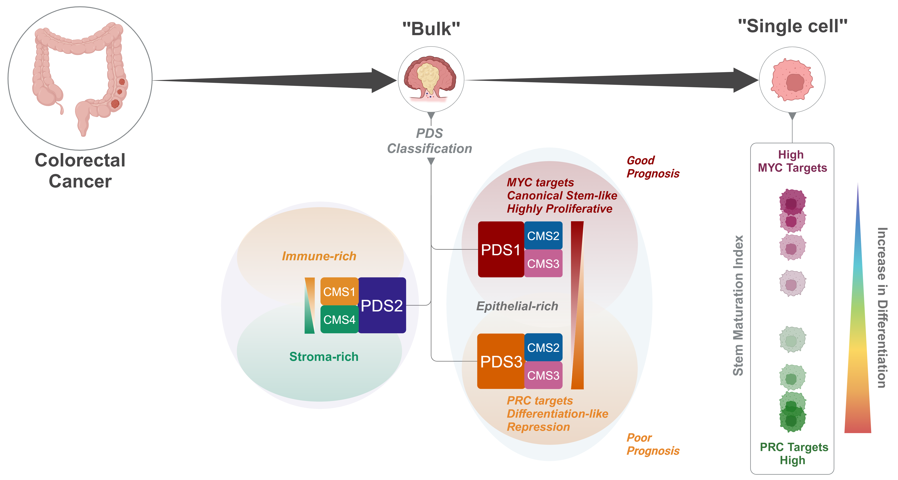

# PDSclassifier

<!-- badges: start -->
<!-- badges: end -->

***PDSclassifier*** R package provides a pathway-based molecular classification system for colorectal cancer (CRC), which can be applied to gene expression profiles to stratify into three [Pathway-Derived Subtype (PDS)](https://www.nature.com/articles/s41588-024-01654-5): PDS1, PDS2 and PDS3, with distinct molecular biology.

 


## Installation

You can install the development version of PDSclassifier like so:

``` r
if(!requireNamespace("devtools", quietly = TRUE))
  install.packages("devtools")
devtools::install_github('sidmall/PDSclassifier')
```

## Usage

An example where using the `testData` from the R package, PDS classification can be made with `PDSpredict()` function.
``` r
library(PDSclassifier)
pds_calls <- PDSpredict(testData, species = 'human', threshold = 0.6)
```

*PDSclassifier* can be applied to both human and mouse transcriptomic data with parameter:
`species = c("human", "mouse")`. The default prediction probability `threshold = 0.6` has been set. The PDS prediction probability ranges between 0 to 1. The recommendation is be stay between 0.5-0.7 to retain enough samples without losing underlying biology that defines PDS.

<br>
Additionally, `calculateSMI()` function enable users to determine if the given sample (bulk tissue or single-cell) is transcriptionally stem-like or differentiated-like with *Stem Maturation Index (SMI)*. The outcome provides single sample gene set enrichment analysis (ssGSEA) score for MYC targets and PRC targets, and from these, *SMI* is calculate (provided unscaled and scaled (-1 to 1)).
``` r
smi_data <- calculateSMI(as.matrix(testdata[,-1]), datatype = "bulk", species = "human")
```

## Citation

The ***PDSclassifier*** R package is developed by the [DunneLab](https://dunne-lab.com/). Please contact [Sudhir Malla (Sid)](https://pure.qub.ac.uk/en/persons/sudhir-malla) for any package related issues, questions, or suggestions.

You can cite as such:
<p>
Malla, S.B., Byrne, R.M., Lafarge, M.W. <em>et al.</em>, Pathway level subtyping identifies a slow-cycling biological phenotype associated with poor clinical outcomes in colorectal cancer. Nat Genet 56, 458–472 (2024). https://doi.org/10.1038/s41588-024-01654-5
</p>

